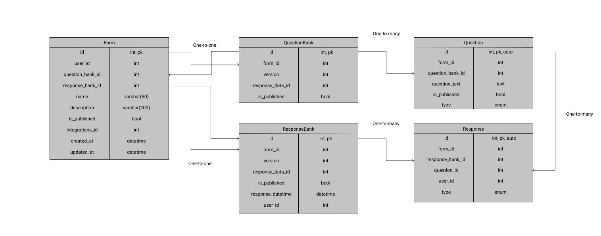

# Plug-ins for Atlan Collect

[Atlan Collect](https://collect.atlan.com/) provides solution for managing data including form responses,
surveys, automated collections, and much more, at scale while still being flexible enough
to instantly change its representation with optimal efficiency.

## How is data stored in Collect?

The form data can be laid out in the following manner:

In the `Response` table, the actual data of the response
recieved by the respondee can be stored in JSON/BLOB format. Depending on the type specified in `type enum`.
This table will also contain the maximum number of rows out of all the tables.

The `ResponseBank` ensures the integrity of all the response data by a user. The number of rows in this
table will be directly proportional to the number of people filling up the responses across the platform.

The layout can be very efficiently implemented with MySQL as the structure relies on many relations within
the table fields.

## Solutions for Plugins

The straight-forward approach will be to create proprietary backend for integrating Collect's data
to various third-party clients like Google Sheets, automator etc. This approach would require developing
backend infrastructure for each and every type of integration demanded by Collect's client.

This idea won't scale up with every unique requirements presented by the clients. Thus, there must be
an interface through which the data of Collect can be sent for further processing as per
the requirements.

This is what we call the _"plug-n-play"_ functionality. And for this, we need to create an API
to serve Collect's data as per the requirement. This also allows third-party entities to make their own
plugins for Collect. This API shall be standalone and seaparate from the backend of the platform.

[Design Specification of the API](./Design-Spec.md)

### Google Sheets

The use case of implementing a plugin for Google Sheets can be achieved by utilizing the API proposed above.

